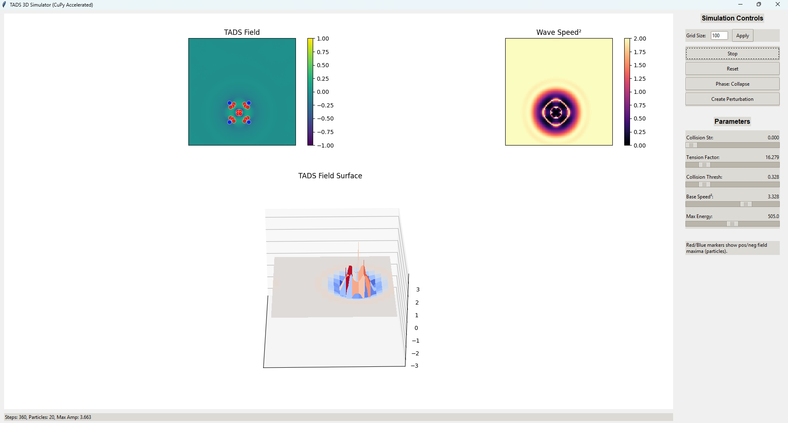

# TADS Particle Simulator (GPU Accelerated)

This program simulates a 2D field where particle-like structures (similar to atoms) can form. It uses your computer's GPU (graphics card) to run fast!



## What it Does

* Simulates a wave-like field based on specific physics rules.
* Shows the field value (2D color plot), the local wave speed (another 2D plot), and the field as a 3D surface.
* Detects and marks "particles" (field peaks) with red/blue dots.
* Lets you control the simulation with buttons and sliders.

## Requirements

* **Python 3**
* **CuPy:** For GPU speed. Install it matching your NVIDIA CUDA version (e.g., `pip install cupy-cuda11x` or `pip install cupy-cuda12x`). If you don't have a compatible GPU or CuPy, it will run *slowly* on your CPU using NumPy/SciPy.
* **Matplotlib:** For plotting (`pip install matplotlib`)
* **NumPy:** (`pip install numpy`)
* **SciPy:** (Needed if CuPy isn't installed - `pip install scipy`)

## How to Run

1.  Save the code as a Python file (e.g., `tads_simulator.py`).
2.  Make sure you have the requirements installed.
3.  Open a terminal or command prompt.
4.  Navigate to the directory where you saved the file.
5.  Run the script:
    ```bash
    python tads_cupy.py
    ```

## Basic Controls

* **Start/Stop:** Runs or pauses the simulation.
* **Reset:** Clears the field and starts over.
* **Phase:** Switches between modes that encourage collapse or stable structures.
* **Create Perturbation:** Adds a disturbance to the field.
* **Grid Size:** Change the size of the simulation area (requires Apply).
* **Sliders:** Adjust physics parameters (Tension, Collision Strength, etc.) to see different behaviors.

Have fun exploring!
